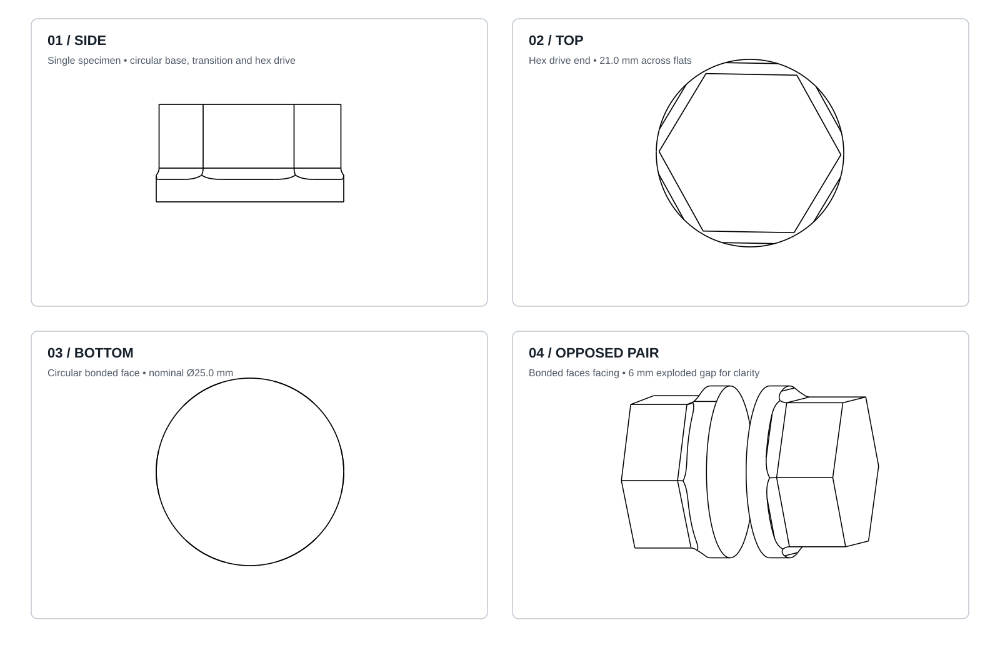

# Essai comparatif d’adhésifs pour polyéthylène téréphtalate modifié au glycol (PETG)

**Fabien Gagné¹, Jacques Girard¹**  
¹ Mostly Intentional Design Labs, Montréal, QC, Canada

## Résumé

Cette étude comparative évalue la performance de six adhésifs pour l’assemblage de pièces imprimées en PETG destinées à une application marine, soit les boîtiers des bouées autonomes du projet [Amavia](https://github.com/fabiengagne/Amavia). Les adhésifs examinés sont un époxy JB Weld, un époxy à prise rapide de 5 minutes, un adhésif polyuréthane Gorilla, un adhésif à bois Titebond III, ainsi que deux cyanoacrylates (CA) de viscosités différentes, régulier et épais. Deux assemblages collés par adhésif, chacun formé de deux pièces imprimées, ont été soumis à un chargement en torsion reproduisant le type de sollicitation attendu sur le col fileté du compartiment batterie. Le couple maximal ainsi que le mode de rupture ont été consignés. Les adhésifs polyuréthane et Titebond III ont présenté les résistances les plus faibles, avec rupture principalement dans l’adhésif. Les époxys ont offert de meilleures performances, mais avec une variabilité notable entre les éprouvettes. Les cyanoacrylates ont fourni les meilleurs résultats : aucun des quatre essais n’a entraîné de rupture du joint. Les résistances observées sont donc rapportées comme des bornes inférieures (> 20,4 N·m), le PETG atteignant sa limite avant le joint dans chacun des quatre essais. Le cyanoacrylate épais a été retenu pour l’application finale en raison de sa résistance mécanique, de son temps de travail supérieur à celui du CA liquide et de sa viscosité mieux adaptée à l’obtention d’un joint continu. Un essai d’étanchéité en immersion est prévu afin de compléter la validation pour l’usage réel.

**Mots-clés :** PETG, adhésif, collage, cyanoacrylate, époxy, torsion, impression 3D, étanchéité, Amavia.

---

## Introduction

L’assemblage par adhésif de pièces issues de fabrication additive constitue un problème distinct de celui des polymères moulés, car la structure couche par couche introduit une anisotropie (propriété qui dépend de la direction dans laquelle on la mesure), une porosité interne et des interfaces inter-couches susceptibles de devenir les éléments limitants du joint. Des travaux consacrés au PETG imprimé par extrusion montrent notamment que les paramètres de fabrication (orientation du raster, largeur d’extrusion, hauteur de couche et qualité des liaisons inter-couches) influencent fortement la rigidité, la résistance et les modes de rupture des pièces [[1](#ref-1), [2](#ref-2), [3](#ref-3)].

Le comportement d’un joint ne dépend par ailleurs pas uniquement de la résistance nominale de l’adhésif. La compatibilité adhésif–substrat, la rigidité relative des deux matériaux, l’épaisseur de la ligne de collage, la géométrie du joint et la préparation de surface peuvent modifier à la fois la charge ultime et le mode de rupture. Une étude récente comparant plusieurs familles d’adhésifs sur des thermoplastiques imprimés, dont le PETG, conclut que le **type d’adhésif** est le facteur dominant de la résistance du joint parmi les variables étudiées [[4]](#ref-4). D’autres travaux spécifiques aux assemblages PETG imprimés confirment que les paramètres d’impression et l’épaisseur de l’adhésif influencent significativement la résistance et le comportement de rupture des joints [[1](#ref-1), [2](#ref-2)].

Les données publiées comparant directement cyanoacrylates et époxys sur **PETG imprimé** demeurent limitées. Sur d’autres polymères imprimés, Yap *et al.* ont toutefois mesuré des résistances de joint plus élevées avec un cyanoacrylate qu’avec un époxy pour les matériaux ASA et Nylon 12 chargé de fibres de carbone [[5]](#ref-5). Cette observation ne peut pas être transposée quantitativement au PETG, mais elle montre que la supériorité d’un époxy ne peut pas être présumée pour une pièce imprimée.

Le présent travail constitue donc un essai comparatif d’ingénierie appliquée, et non une caractérisation normalisée de propriétés adhésives. Son objectif est d’identifier un système de collage approprié au col fileté du compartiment batterie d’une bouée Amavia, soumis à des sollicitations répétées en torsion et devant ultérieurement assurer une fonction d’étanchéité.

---

## Objectif

L'objectif de cet essai est de déterminer **quel adhésif convient le mieux pour assembler durablement des pièces imprimées en PETG destinées aux bouées Amavia**, en particulier le col fileté/couvercle du compartiment batterie.

Ce joint doit :

- supporter des efforts de torsion répétés lors de l'ouverture et de la fermeture du couvercle ;
- conserver une bonne résistance mécanique ;
- rester étanche dans un environnement aquatique.

L'essai vise avant tout une **comparaison pratique entre plusieurs adhésifs facilement disponibles**, plutôt qu'une mesure normalisée de résistance absolue.

Deux assemblages collés sont testés par adhésif. Cet échantillonnage est faible, mais suffisant pour obtenir une première comparaison entre les produits.

---

## Adhésifs testés

Six produits ou familles d’adhésifs ont été comparés :

| Adhésif | Type | Manufacturier / siège social |
|---|---|---|
| **J-B Weld, Epoxy Steel Resin / Epoxy Steel Hardener (28,4 g chacun)** | Époxy bicomposant | **J-B Weld Company, LLC** (Marietta, Georgia, États-Unis) |
| **Original Gorilla Glue Minis** | Adhésif polyuréthane | **The Gorilla Glue Company** (Cincinnati, Ohio, États-Unis) |
| **stuck Thick Gel Super Glue, 3 g** | CA visqueux, produit bon marché provenant de Dollarama | **stuck** (manufacturier réel non identifié avec certitude ; produit commercialisé chez Dollarama. **Dollarama Inc.** (Montréal, Québec, Canada) est indiqué ici comme détaillant/distributeur, et non comme manufacturier confirmé. |
| **stuck Super Glue, 1 g** | CA liquide, même marque que le CA épais | **stuck** (manufacturier réel non identifié avec certitude ; produit commercialisé chez Dollarama. **Dollarama Inc.** (Montréal, Québec, Canada) est indiqué ici comme détaillant/distributeur, et non comme manufacturier confirmé. |
| **Titebond III Ultimate Wood Glue, 8 fl oz (237 mL)** | Adhésif à bois résistant à l'eau | **Franklin International, Inc.** (Columbus, Ohio, États-Unis) |
| **System Three Quick Cure 5, 5 Minute Epoxy Adhesive, 4 fl oz (118 mL) par composant** | Époxy à prise rapide, 5 minutes | **System Three Resins, Inc.** (Lacey, Washington, États-Unis) |

La Titebond III est incluse comme essai exploratoire. Elle n'est pas destinée au PETG, mais sa fluidité et sa résistance à l'eau rendaient intéressant de vérifier si elle pouvait pénétrer dans la texture de l'impression et fournir un collage acceptable.

### Identification des manufacturiers

Les sièges sociaux des fabricants identifiés ont été vérifiés à partir de sources publiques des entreprises. Pour les cyanoacrylates **stuck**, les photographies confirment les désignations commerciales et leur vente chez Dollarama, mais ne permettent pas d'identifier de manière fiable l'entité manufacturière derrière le produit. Pour cette raison, **Dollarama Inc. (Montréal, Québec, Canada)** est mentionnée uniquement comme détaillant/distributeur. L'époxy à prise rapide a pu être identifié visuellement comme **System Three Quick Cure 5**, fabriqué par **System Three Resins, Inc.**

Les photographies des contenants montrent les codes de sertissage ou d'emballage suivants : **250328** sur le tube Original Gorilla Glue Minis, **0526** sur le tube stuck Thick Gel Super Glue et **0326** sur le tube stuck Super Glue. Aucun libellé sur les emballages ne permet d'établir avec certitude qu'il s'agit de numéros de lot ou de dates d'expiration. Ils sont donc consignés uniquement comme **codes d'emballage visibles**. La [photographie des deux flacons System Three](../../media/photos/system-three-epoxy-bottles.jpeg) ne montre pas de numéro de lot lisible. Aucun numéro de lot explicite ni date d'expiration n'est visible sur les contenants J-B Weld ou Titebond III photographiés. Les dates d'achat n'ont pas été consignées.

---

# Protocole d'essai

## Matériau imprimé

Les éprouvettes et les pièces d’application ont été fabriquées en **OVERTURE PETG Rock White, diamètre 1,75 mm**, commercialisé par **Overture 3D Technologies, LLC** (10777 Westheimer Rd, Suite 159, Houston, Texas 77042, États-Unis). L’[étiquette de la bobine photographiée](../../media/photos/petg-filament-lot.jpeg) porte le **numéro de lot 16033**.

## Paramètres d’impression

Les éprouvettes ont été imprimées sur une **Original Prusa i3 MK3** en utilisant le profil Prusa par défaut pour filament PETG, avec les paramètres suivants. Les fichiers d’impression des éprouvettes ont été préparés avec **PrusaSlicer 2.9.6**, version confirmée par le chercheur et visible sur la [photographie du raccourci](../../media/photos/prusaslicer-version.jpeg).

- diamètre de la buse : **0,4 mm** ;
- température de la buse : **250 °C** ;
- température du plateau : **80 °C** ;
- plateau : **surface PEI originale Prusa** ;
- aucun adhésif appliqué sur le plateau ;
- nettoyage du plateau à l’**alcool isopropylique à 99 % avant chaque impression** ;
- hauteur de couche : **0,15 mm** ;
- remplissage : **15 %** ;
- parois : **4 périmètres** ;
- couches supérieures : **6** ;
- couches inférieures : **6**.

Les éprouvettes ont été imprimées avec **l’interface de collage directement sur le plateau**, de sorte que la face collée correspond à la surface de la première couche.

## Éprouvettes

Pour chaque adhésif, **deux assemblages collés** ont été testés. Chaque assemblage réunit **deux pièces imprimées en PETG** par leurs faces circulaires : la série comprend donc **12 assemblages testés et 24 pièces imprimées**. Les identifiants A et B désignent les assemblages d’un même adhésif, et non les deux moitiés d’un assemblage.

La géométrie permet d'appliquer un **couple de torsion**, afin de reproduire le plus fidèlement possible le chargement réel attendu sur le col fileté du compartiment batterie.

Le modèle de stéréolithographie (STL) fourni a été mesuré directement. L’éprouvette mesure **13,0 mm de hauteur totale** et **25,0 mm de diamètre maximal**. Sa base circulaire mesure **3,0 mm de hauteur** et **25,0 mm de diamètre nominal**. L’interface de collage est la face de première couche de cette base, imprimée directement sur le plateau, avec une aire plane nominale de **490,9 mm²**. L’extrémité opposée comporte une prise hexagonale de **21,0 mm entre plats**. La zone cylindrique de collage se raccorde à la zone hexagonale au-dessus de la face collée.

Les premières éprouvettes possèdent une prise carrée. Les suivantes utilisent la prise hexagonale de 21,0 mm entre plats représentée par le fichier STL et peuvent être engagées directement dans une douille. Cette modification du montage constitue une limite de cette série préliminaire.

Le fichier STL original de l’éprouvette est disponible dans le dépôt à l’emplacement `supplementary/stl/adhesive-test-specimen.stl`.

*Figure 1. Géométrie d’une pièce imprimée : (A) vue de côté, (B) vue de dessus et (C) vue de dessous. (D) Projection de deux pièces orientées face de collage contre face de collage; leur écartement de 6 mm sert uniquement à les distinguer avant l’assemblage et ne représente pas l’épaisseur du joint. Les annotations de la figure sont en anglais.*

### Préparation des surfaces et collage des éprouvettes

Pour tous les systèmes adhésifs, les deux surfaces à assembler ont été abrasées avec du papier sablé **grain 600**, puis nettoyées à l’**alcool isopropylique à 99 %** avant collage.

Après application de l’adhésif et assemblage, les éprouvettes ont été **positionnées puis laissées au repos sans pression de serrage appliquée** pendant la polymérisation. La polymérisation a été effectuée à environ **22 °C** et **40 % d’humidité relative**. Toutes les éprouvettes collées ont polymérisé pendant **13 jours avant les essais mécaniques**.

## Instrumentation

Le couple est mesuré à l'aide d'une **clé dynamométrique numérique SOARFLY, modèle YX01-24, numéro de série SN:20260702093** ([photographie](../../media/photos/torque-wrench-serial.jpeg); *Digital Torque Wrench*), dont l’affichage a une résolution de **0,1 N·m**. La fiche commerciale indique une capacité maximale de **220 N·m** et une exactitude annoncée de **±1 %**. Cette dernière valeur est une spécification du vendeur, et non une exactitude démontrée pour les présentes mesures.

Avant les essais, une **vérification fonctionnelle interne** a été effectuée avec des masses connues et des bras de levier mesurés, dans le sens horaire. Aux cinq points vérifiés, d’environ **3 à 15 N·m**, l’écart relatif maximal observé était de **2,92 %**. Cette vérification appuie l’usage comparatif de la clé, mais ne constitue pas un étalonnage traçable et ne démontre pas l’exactitude annoncée de ±1 %. Le rapport final de vérification est conservé sous `internal-tests/torque-wrench-verification/torque-wrench-verification-report.md`.

L’éprouvette est maintenue dans un étau par sa géométrie de prise ou par une douille, selon la version de l’éprouvette. Le couple est augmenté manuellement jusqu’à l’apparition d’un des événements suivants :

- rupture de l’adhésif ou de l’interface ;
- rupture ou délamination du PETG imprimé ;
- déformation permanente de l’éprouvette ;

L’instrument conserve la valeur maximale atteinte pendant chaque chargement.

Les résultats sont exprimés sous forme de **couple appliqué en N·m**. Ils ne sont pas convertis en contrainte de cisaillement de l’adhésif, puisque la géométrie du joint et la distribution des contraintes sont spécifiques à l’application et ne correspondent pas à un essai de cisaillement uniforme normalisé.

## Critères observés

Le couple maximal n'est pas le seul critère utilisé.

Le **mode de rupture** est également observé visuellement après l’essai :

- rupture de l’adhésif ou de la ligne de collage ;
- décollement de l’interface ;
- fissuration du PETG ;
- délamination inter-couches du PETG ;
- rupture du PETG ;
- déformation permanente de l’éprouvette ;

Lorsque le PETG atteint sa limite avant la rupture du joint, la valeur obtenue est considérée comme une **borne inférieure de la résistance réelle du joint** et est rapportée avec le symbole « > ».

## Déclaration d’utilisation de l’intelligence artificielle

OpenAI Codex a été utilisé pour aider à réviser la rédaction du manuscrit, vérifier des renseignements bibliographiques, préparer la figure 1 à partir du STL du projet au moyen de FreeCAD et structurer le fichier CSV à partir de la vidéo des essais et des valeurs déjà consignées. Aucun outil d’intelligence artificielle n’a réalisé les essais ni produit les mesures de couple. Les auteurs demeurent responsables de la vérification des sources, de l’analyse et du contenu final.

---

# Résultats

| Adhésif | Assemblage A | Assemblage B | Observation principale |
|---|---:|---:|---|
| **Gorilla polyuréthane** | **5,4 N·m** | **3,0 N·m** | Rupture de l’adhésif |
| **Titebond III** | **9,8 N·m** | **7,0 N·m** | Rupture nette de l’adhésif |
| **JB Weld** | **16,1 N·m** | **11,8 N·m** | Début de rupture/délamination du PETG ; variabilité |
| **System Three Quick Cure 5** | **18,6 N·m** | **12,8 N·m** | À 18,6 N·m, le PETG casse avant l’adhésif ; l'autre joint cède |
| **CA régulier (CAR)** | **> 20,4 N·m** | **> 20,5 N·m** | Aucune rupture du joint ; limite imposée par le PETG |
| **CA épais (CAE)** | **> 20,9 N·m** | **> 20,8 N·m** | Aucune rupture du joint ; limite imposée par le PETG |

## Gorilla polyuréthane

Résultats :

- **5,4 N·m**
- **3,0 N·m**

La rupture se produit dans l’adhésif lui-même.

Le PETG demeure pratiquement intact, ce qui indique que l'adhésif est clairement le maillon faible.

**Moyenne approximative : 4,2 N·m.**

C'est le moins performant des produits testés.

## Titebond III

Résultats :

- **9,8 N·m**
- **7,0 N·m**

Dans les deux cas, le joint adhésif cède sans dommage notable au PETG.

**Moyenne : 8,4 N·m.**

La performance est meilleure que celle du polyuréthane, mais nettement inférieure aux époxys et aux cyanoacrylates.

## JB Weld

Résultats :

- **16,1 N·m**
- **11,8 N·m**

À forte charge, on commence à observer de la fissuration ou de la délamination du PETG.

L’adhésif présente également de bonnes propriétés pratiques d'application :

- bonne épaisseur ;
- couverture facile à contrôler ;
- application relativement simple.

Cependant, les deux éprouvettes présentent une dispersion importante.

**Moyenne : environ 14,0 N·m.**

## System Three Quick Cure 5

Résultats :

- **18,6 N·m**
- **12,8 N·m**

À **18,6 N·m**, ce n'est pas le collage qui casse : c'est le PETG lui-même.

Sur le second échantillon, le joint adhésif finit par céder à **12,8 N·m**, avec également un début de fissuration du matériau.

**Moyenne : 15,7 N·m.**

Cet adhésif offre donc une bonne résistance, mais une certaine variabilité entre les éprouvettes.

---

# Cyanoacrylate régulier

Résultats :

- **CAR-A > 20,4 N·m**
- **CAR-B > 20,5 N·m**

Aucune rupture du joint n’a été observée lors des deux essais.

Dans les deux cas, le PETG a atteint sa limite avant la rupture du joint.

Il n’est donc pas approprié de calculer une moyenne de rupture pour le CA régulier. Les valeurs mesurées doivent être interprétées comme des **bornes inférieures** de la résistance du joint.

**Résistance du joint CA régulier : > 20,4–20,5 N·m dans les conditions de cet essai.**

---

# Cyanoacrylate épais

Résultats :

- **CAE-A > 20,9 N·m**
- **CAE-B > 20,8 N·m**

Aucune rupture du joint n’a été observée lors des deux essais.

Comme pour le CA régulier, le PETG a atteint sa limite avant la rupture du joint. Les valeurs mesurées constituent donc des **bornes inférieures** et non des couples de rupture.

**Résistance du joint CA épais : > 20,8–20,9 N·m dans les conditions de cet essai.**

Le résultat demeure particulièrement intéressant considérant qu’il s’agit d’un cyanoacrylate épais bon marché provenant de Dollarama.

Une réserve demeure toutefois quant à la répétabilité du produit : rien ne garantit qu’un tube acheté plus tard contiendra exactement la même formulation.

---

# Discussion

## Comparaison des performances

Dans les conditions de ce montage, l’ordre observé est :

**CA épais ≈ CA régulier > System Three Quick Cure 5 > JB Weld > Titebond III > Gorilla polyuréthane**

Cette relation doit être interprétée avec prudence. Les valeurs associées aux cyanoacrylates ne sont pas des couples de rupture : **aucun des quatre joints CA n’a rompu**. Les résultats sont donc des bornes inférieures :

- **CAR-A > 20,4 N·m** ;
- **CAR-B > 20,5 N·m** ;
- **CAE-A > 20,9 N·m** ;
- **CAE-B > 20,8 N·m**.

Les essais établissent ainsi que, pour la géométrie, le PETG, la préparation de surface et les produits utilisés ici, les deux formulations de cyanoacrylate supportent **plus de 20 N·m**. Le couple de rupture réel du joint n’a pas été déterminé.

## Mode de rupture et rôle du PETG imprimé

Le passage d’une rupture de l’adhésif à une déformation, une délamination ou une rupture du PETG est particulièrement significatif. Dans la littérature sur les assemblages de pièces imprimées, une rupture de l’adhérent peut survenir lorsque la résistance de l’interface de collage excède la résistance inter-couches de la pièce imprimée [[4]](#ref-4). Cette interprétation est compatible avec les observations faites ici pour les CA et, sur un des essais, pour le System Three Quick Cure 5.

Ce comportement est aussi cohérent avec la nature anisotrope des pièces fabriquées par dépôt de matière fondue (*Fused Deposition Modeling*, FDM). Les études consacrées au PETG montrent que la microstructure produite par dépôt couche par couche, l’orientation des filaments et la qualité des interfaces inter-couches modifient la réponse mécanique et peuvent favoriser la délamination [[1](#ref-1), [2](#ref-2), [3](#ref-3)]. Ainsi, lorsqu’une éprouvette se déforme ou se délamine avant le joint, l’essai ne caractérise plus seulement l’adhésif : il devient aussi un essai de la pièce imprimée et de la géométrie de serrage.

## Mise en perspective avec la littérature

Les résultats obtenus ne sont pas directement comparables aux valeurs de résistance publiées dans les essais de type *single-lap joint*, puisque le présent montage applique un **couple de torsion** sur une géométrie spécifique à l’application. Ils concordent néanmoins avec plusieurs tendances publiées.

Premièrement, la littérature montre que le choix de l’adhésif peut dominer la résistance d’un joint sur thermoplastique imprimé. Dans l’étude d’Öz et Öztürk, qui compare quatre familles d’adhésifs et quatre thermoplastiques imprimés, le type d’adhésif représente la contribution statistique la plus importante à la résistance du joint ; le polyuréthane est également la famille qui présente la capacité portante la plus faible dans leur série d’essais [[4]](#ref-4). Les formulations et la géométrie étant différentes, cela ne constitue pas une validation directe de notre classement, mais fournit un contexte cohérent avec la faible performance du Gorilla polyuréthane observée ici.

Deuxièmement, les essais de Vamshinath *et al.* et de Khosravani *et al.* sur des joints PETG imprimés montrent que l’épaisseur du joint ainsi que les paramètres d’impression modifient la résistance et les modes de rupture [[1](#ref-1), [2](#ref-2)]. La performance mesurée dans le présent travail doit donc être considérée comme propre au procédé d’impression, à l’état de surface, à la géométrie et à l’application des adhésifs utilisés.

Troisièmement, Yap *et al.* ont observé, sur deux autres polymères imprimés, des joints cyanoacrylate plus résistants que des joints époxy [[5]](#ref-5). Bien que leurs substrats ne soient pas du PETG, ce résultat montre qu’un CA peut surpasser un époxy sur des pièces FDM et donne un précédent scientifique compatible avec notre observation expérimentale.

## Cyanoacrylate régulier et cyanoacrylate épais

Le présent protocole ne permet pas de distinguer mécaniquement les deux CA : les quatre éprouvettes ont atteint la limite du PETG sans rupture du joint. Le choix du **CA épais** repose donc principalement sur des considérations de mise en œuvre plutôt que sur une différence de résistance démontrée.

Le CA régulier polymérise très rapidement et sa faible viscosité complique le contrôle d’un joint circulaire de grande dimension. Le CA épais offre, dans l’expérience réalisée, environ **1 à 2 minutes de temps de travail**, permet un repositionnement et facilite l’observation d’une couverture continue. Pour le col du compartiment batterie, ces caractéristiques réduisent le risque pratique de laisser une zone insuffisamment mouillée.

L’hypothèse formulée pendant l’essai selon laquelle le CA pourrait pénétrer davantage dans la texture superficielle du PETG reste plausible, mais **n’est pas démontrée** par les mesures présentes. La littérature consultée permet d’affirmer que la préparation de surface et la structure imprimée peuvent influencer la performance d’un joint [[1](#ref-1), [2](#ref-2), [4](#ref-4)], mais elle ne permet pas d’attribuer ici la bonne performance du CA à un mécanisme microscopique particulier.

## Retour communautaire complémentaire

À titre de contexte non scientifique, une discussion substantielle de la communauté r/3Dprinting consacrée spécifiquement au collage du PETG rassemble de nombreux retours d’expérience sur différents adhésifs et méthodes de préparation [[6]](#ref-6). Plusieurs participants y rapportent de bons résultats avec des époxys destinés aux plastiques, notamment des produits J-B Weld, tandis que d’autres mentionnent le cyanoacrylate, E6000 ou des adhésifs de soudage chimique pour thermoplastiques. La préparation de surface, en particulier l’élimination de la peinture et le ponçage des faces à assembler, y est également soulignée de façon récurrente.

Cette source est utilisée uniquement comme **contexte communautaire** et non comme preuve expérimentale contrôlée. Elle illustre surtout la diversité des pratiques et l’absence d’un consensus simple applicable à toutes les géométries, formulations de PETG et conditions de chargement.

## Limites de l’étude

Plusieurs limites doivent être conservées à l’esprit :

- seulement **deux assemblages par adhésif** ont été testés ;
- le protocole n’est pas un essai normalisé de type *American Society for Testing and Materials* (ASTM) D3163 ;
- la géométrie et le mode de chargement sont volontairement spécifiques à l’application Amavia ;
- les quatre essais CA sont **censurés par la limite du PETG**, et non par rupture du joint ;
- la vérification fonctionnelle de la clé couvrait environ 3 à 15 N·m, en deçà des couples les plus élevés de cette étude ; elle ne constitue pas un étalonnage traçable, l’incertitude de mesure n’a pas été évaluée formellement et la vitesse d’application du couple aux éprouvettes n’a pas été mesurée ;
- deux géométries de prise ont été utilisées pendant cette série préliminaire ;
- la résistance à l’eau, au vieillissement, aux cycles thermiques et aux ouvertures/fermetures répétées n’est pas encore caractérisée ;
- la formulation exacte des cyanoacrylates stuck n’est pas documentée et pourrait varier avec l’approvisionnement.

Un travail ultérieur pourrait utiliser davantage d’éprouvettes, une géométrie d’éprouvette et un mode de chargement permettant de solliciter les joints CA jusqu’à leur rupture sans défaillance préalable du PETG, et un protocole normalisé de cisaillement en recouvrement en complément du présent essai applicatif. Des essais après immersion et après cyclage mécanique seraient particulièrement pertinents pour l’usage marin visé.

---

# Choix retenu : cyanoacrylate épais

Même si le CA liquide donne une résistance mécanique pratiquement identique, le CA épais présente plusieurs avantages importants pour l'application Amavia.

## CA régulier

Le CA liquide :

- prend en quelques secondes ;
- laisse très peu de temps pour repositionner les pièces ;
- est très fluide ;
- peut facilement couler hors de la zone de collage ;
- est plus difficile à répartir uniformément sur un grand joint.

## CA épais

Le CA épais :

- offre environ **1 à 2 minutes de temps de travail** ;
- permet de repositionner les pièces ;
- est plus facile à appliquer uniformément ;
- permet de mieux vérifier visuellement la couverture du joint ;
- reste suffisamment fluide pour bien mouiller les surfaces.

Pour un grand joint circulaire devant également assurer l'étanchéité, ces caractéristiques sont particulièrement intéressantes.

Une hypothèse proposée pendant l'essai est que le cyanoacrylate pourrait également pénétrer légèrement dans la structure superficielle du PETG imprimé et obtenir ainsi un meilleur ancrage mécanique que des adhésifs plus visqueux.

Cette hypothèse n'est toutefois pas démontrée par l'essai.

---

# Application sur la pièce réelle

À la suite des essais mécaniques, le **cyanoacrylate épais** est choisi pour assembler le véritable col fileté au boîtier.

## Préparation des surfaces

Les deux surfaces sont :

1. poncées à différents grades de papier abrasif ;
2. nettoyées avec de l'**alcool isopropylique à 99 %** ;
3. enduites d’adhésif ;
4. assemblées en s'assurant que toute la circonférence du joint est couverte.

L’adhésif est appliqué sur les deux surfaces.

## Avantages observés pendant l'assemblage

Le temps de prise du CA épais permet :

- de positionner correctement les deux pièces ;
- de faire de petits ajustements après le premier contact ;
- de vérifier que l’adhésif forme un joint continu sur toute la circonférence.

L’adhésif étant transparent, le résultat est également relativement discret sur le plan esthétique.

---

# Étape suivante

La prochaine étape annoncée est un **essai d'étanchéité dans l'eau** du véritable boîtier assemblé avec le CA épais.

L'objectif sera de vérifier que l'excellente résistance mécanique observée lors des essais de torsion s'accompagne également d'une bonne résistance à l'eau et d'une étanchéité durable.

---

# Conclusion

Dans les conditions spécifiques de cet essai, les six adhésifs présentent des comportements nettement différents. Le **Gorilla polyuréthane** et le **Titebond III** atteignent les plus faibles couples avant rupture du joint. Les deux époxys offrent des performances sensiblement supérieures, mais avec une dispersion notable entre les deux éprouvettes.

Les deux **cyanoacrylates**, régulier et épais, constituent le résultat principal de l’étude : **aucun des quatre joints n’a rompu**. Les valeurs CAR-A > 20,4 N·m, CAR-B > 20,5 N·m, CAE-A > 20,9 N·m et CAE-B > 20,8 N·m doivent donc être considérées comme des bornes inférieures. À ces niveaux, le PETG devient le facteur limitant dans les quatre essais.

La littérature disponible confirme que la performance des joints sur pièces imprimées dépend fortement de la famille d’adhésif, des paramètres d’impression et du mode de rupture [[1](#ref-1), [2](#ref-2), [3](#ref-3), [4](#ref-4), [5](#ref-5)]. Elle fournit également des précédents où le cyanoacrylate surpasse l’époxy sur d’autres polymères FDM [[5]](#ref-5), sans toutefois permettre de généraliser ce résultat à tous les PETG ou à tous les produits commerciaux.

Pour l’application Amavia, le **cyanoacrylate épais** est retenu non parce qu’il a démontré une résistance supérieure au CA régulier (ce que le montage actuel ne permet pas d’établir), mais parce qu’il combine une résistance du joint supérieure à la limite atteinte par le PETG lors de l’essai avec une viscosité et un temps de travail plus favorables à la réalisation d’un joint circulaire continu.

La validation n’est pas complète tant que la tenue à l’immersion, au vieillissement et aux cycles répétés de torsion n’a pas été mesurée. Le prochain jalon expérimental est donc l’essai d’étanchéité et de durabilité du boîtier assemblé.

Les fichiers de projet et le matériel complémentaire sont maintenus dans le dépôt public **Mostly Intentional Design Labs / petg-adhesive-study**. Le fichier STL original de la pièce est disponible sous `supplementary/stl/adhesive-test-specimen.stl`; le dessin utilisé à la figure 1 se trouve sous `media/figures/specimen-freecad-candidate.svg`. Les 12 résultats individuels, dans l’ordre des essais indiqué par la vidéo de l’expérience, sont fournis sous `data/torsional-screening-results.csv`. Les photographies des essais et des emballages sont dans `media/photos/`.

---

# Références

**[1]** Vamshinath, K., Niteesh Kumar, N., Tarun Kumar, R., Nagaraju, D. S., Sateesh, N. & Subbaiah, R. (2022). “Analysis of the effect of the process parameters on the mechanical strength of 3D printed and adhesively bonded PETG single lap joint.” *Materials Today: Proceedings*, 62, 4509–4514. https://doi.org/10.1016/j.matpr.2022.04.950

**[2]** Khosravani, M. R., Soltani, P. & Reinicke, T. (2021). “Fracture and structural performance of adhesively bonded 3D-printed PETG single lap joints under different printing parameters.” *Theoretical and Applied Fracture Mechanics*, 116, 103087. https://doi.org/10.1016/j.tafmec.2021.103087

**[3]** Özen, A., Abali, B. E., Völlmecke, C., Gerstel, J. & Auhl, D. (2021). “Exploring the Role of Manufacturing Parameters on Microstructure and Mechanical Properties in Fused Deposition Modeling (FDM) Using PETG.” *Applied Composite Materials*, 28, 1799–1828. https://doi.org/10.1007/s10443-021-09940-9

**[4]** Öz, Ö. & Öztürk, F. H. (2025). “The effect of adhesive and adherend compliance on the failure of 3D-printed parts.” *Welding in the World*, 69, 2869–2883. https://doi.org/10.1007/s40194-025-02048-9

**[5]** Yap, Y. L., Toh, W., Koneru, R., Lin, R., Chan, K. I., Guang, H., Chan, W. Y. B., Teong, S. S., Zheng, G. & Ng, T. Y. (2020). “Evaluation of structural epoxy and cyanoacrylate adhesives on jointed 3D printed polymeric materials.” *International Journal of Adhesion and Adhesives*, 100, 102602. https://doi.org/10.1016/j.ijadhadh.2020.102602

**[6]** Reddit, r/3Dprinting (2024). “What glue/adhesives do you use for PETG? I tried super glue, gorilla glue, scigrip weld on glue but nothing seems to hold...” Discussion communautaire portant sur les adhésifs pour PETG, la préparation de surface et les retours d’expérience avec différents produits. https://www.reddit.com/r/3Dprinting/comments/1c3fd63/what_glueadhesives_do_you_use_for_petg_i_tried/

